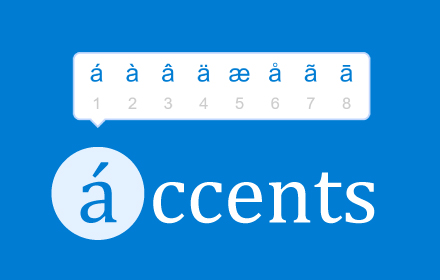
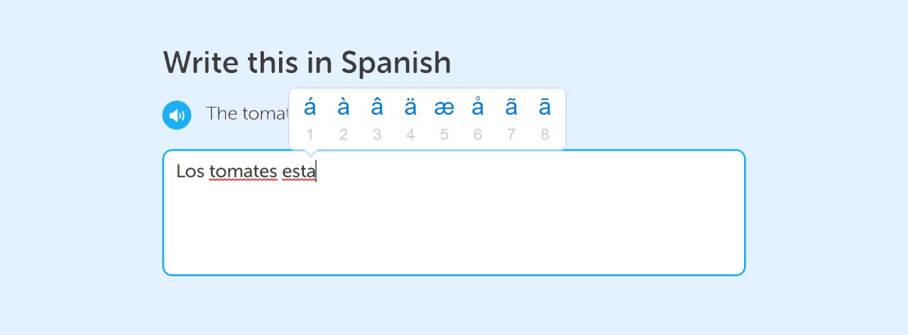

# Accents

 

  

 

Accents is a Chrome extension that emulates the [diacritic system from macOS](https://support.apple.com/guide/mac-help/enter-characters-with-accent-marks-on-mac-mh27474/mac). Accents allows you to type accents, symbols, and special characters from a wide variety of languages through a simple popup system.

 

  

 

*This version does not work on Google Docs and Gmail. We might have a fix soon, or not.* 

## Installation
 ~~Thank you for 35k users!~~

Apologies for the inconvinience, but Accents is not downloadable at the moment. We are currently reworking the core functionality and will have it back on the Chrome Store as soon as possible.
<!---You cannot download it [here.](https://chrome.google.com/webstore/detail/accents-spanish-portugues/laiognlohmgkmlfchcclnjnafgeinnpg)-->

## Usage
1. Hold down a key when typing and wait for the pop-up to appear. Try it with uppercase letters, punctuation marks, and other symbols too.
2. To select the character you desire, you can either press the number or click on the button itself. 
3. There is also a shortcut you can use: while holding the key, press the number of the button before the popup appears.
4. Enjoy! :)
